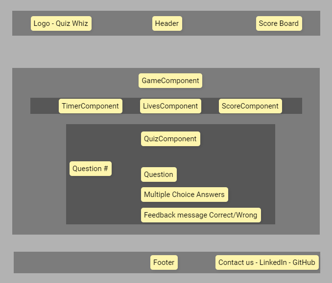

https://gist.git.generalassemb.ly/katie/d4c2013a89a9a3da9650cc6c5851b07f

### Components

API: https://opentdb.com/api_config.php?ref=altcademy.com

### App:

    state:
        category: check if the category changed

        score: count the score

        lives: count the active lives. If no more lives, the game is over and it renders the score board.

        timeStatus: beforeQuestionCountDown, duringQuestionCountDown, afterQuestionCountDown

    HeaderComponent: Display logo and app name.

    HowToPlayComponent: Display game instructions.

    SelectCategoryComponent: Allow user to select the trivia category.

         props:
            onCategoryChange (callback to set the category state in App)
        state:
            selectedCategory

    ReadyToStartGameComponent: Button or interface to start the game once a category is selected.

    GameComponent: Main game interface.
        props:
            category
        state:
            questions (Array of questions fetched from the API) - is this state or props?
            currentQuestionIndex

        ScoreComponent: Displays current score. Receives the score props from GameComponent
            props: score

        TimerComponent: show decrement time starting at 20s
            props:
                inTimeIsOver (Callback when timer reaches 0)
                Callback: onTimeIsOver update the state of the game (similar as onWrongAnswer?)
            state:
                secondsLeft (displays the number of seconds left.)

        LivesComponent: show lives - heart shape - background red: full life - no background: no life.
            props:
                lives
            WHERE TO CHECK IF NO LIVES THEN GAME OVER?

        QuizComponent: Display the current question and possible answers.
            If wrong answer, give feedback and moves into the next question, no points, loose 1 life. If correct answer, show feedback and moves into the next question, add points, lives not affected.
            props:
                currentQuestion
                answerIndex - When render app, no question is selected yet
                onCorrectAnswer
                onWrongAnswer
            state:
                selectedAnswer (start as null and is modified by clicking on a answer and assigns the answer to the state)

                GameOverComponent: is it necessary if we just want to display a "game over" message?

                YouWinComponent: is it necessary if we just want to display a "you win" message?

                ScoreBoardComponent : user adds their name and then it shows a score board containing the user name and total score
                    state:
                        playerName - is it state or props?
                        scoreList (List of scores fetched from a backend or local storage) - is it state or props?

    FooterComponent (Contains any relevant information or links.)

### Future Add ons:

    LoginRegisterButton Component: Redirects to login/register page.

    UserAuth Component (User Authentication):

        Login Component: Contains fields for username/email and password.
        Register Component: Fields for username, email, password, and confirm password.
            ChatRoomComponent: Real-time chat room for players.

### Routes

    HomeRoute: This route displays the HowToPlayComponent, SelectCategoryComponent, and the ReadyToStartGameComponent.

    GameRoute: This route displays the GameComponent with all its child components

    ScoreBoardRoute: This route displays the ScoreBoardComponent.

### Feature:

    "Copy the url" button in the score board to share with friends (https://blog.dadops.co/2021/03/17/copy-and-paste-in-a-react-app/)

### App Flow and Wireframes:

1. **Landing Page**:

   - User arrives at the landing page.
   - **HeaderComponent** is displayed with the app logo and name.
   - **HowToPlayComponent** explains how the game works.
   - **SelectCategoryComponent** allows users to choose a trivia category.
   - **ReadyToStartGameComponent**: After selecting a category, this component prompts the user to start the game.

      

2. **Game Start**:

   - On clicking "Start Game" in **ReadyToStartGameComponent**, the user is redirected to the **GameRoute**.
   - **GameComponent** initializes: - The **TimerComponent** starts the countdown from 20 seconds for the first question. - The **ScoreComponent** shows the initial score (likely 0). - The **LivesComponent** displays the number of lives the user starts with. - The **QuizComponent** fetches and displays the first question and answer options from the chosen category.
   
     

3. **During Gameplay**:

   - The user selects an answer in the **QuizComponent**.
   - If correct:
     - The score updates in the **ScoreComponent**.
     - Move on to the next question.
   - If wrong:
     - A life is deducted in the **LivesComponent**.
     - Move on to the next question.
   - If the timer in the **TimerComponent** runs out before the user answers: - It acts as a wrong answer. - A life is deducted, and the game proceeds.

      

4. **End Game Scenarios**:

   - If the user runs out of lives, **GameOverComponent** is displayed with their score and an option to try again or view the scoreboard.
   - If there's a set number of questions or a winning condition and the user fulfills it, **YouWinComponent** is displayed with the same options as the Game Over scenario.

   <!-- change the YouWinComponent to just display the score board, there will be no really win, as long the the player still have lives they will reach the end of the game and enter in the score board -->

6. **Scoreboard**:

   - Once the game ends, the **ScoreBoardComponent** will mount and the player can add their names to the score board.
   - The user can enter their name and view their score alongside other player scores (if backend integration is done).

      

7. **Returning to Home**:

   - The user can always navigate back to the landing page using a home button or icon.

8. **Footer**:
   - Displayed consistently across routes/pages, containing any additional links or information.

### Future Flow Expansion:

<!-- what is it? isnt it already mentioned before? -->

1. **URL Sharing**:

   - Within the **ScoreBoardComponent**, the user can copy the URL to share their score or the game itself.

2. **OpenAI API**:
   - Integrate the app with AI to generate questions and check the answers given by the user.
