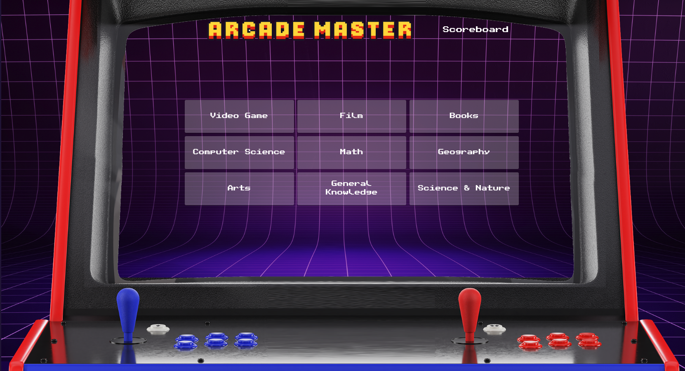
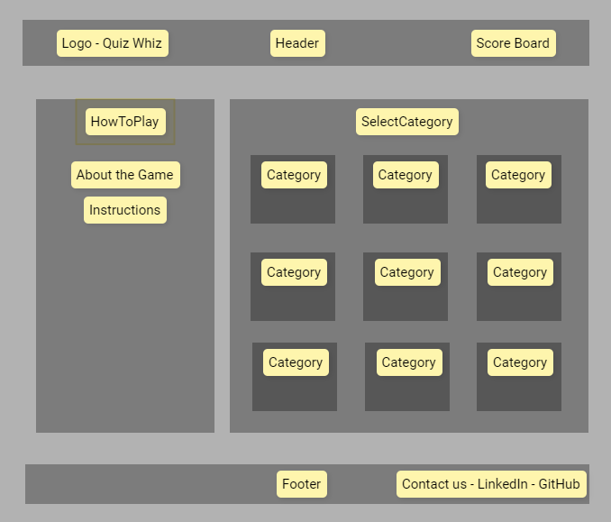
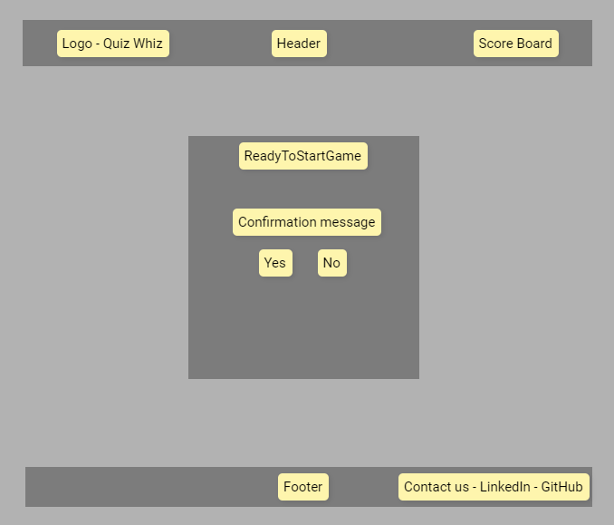
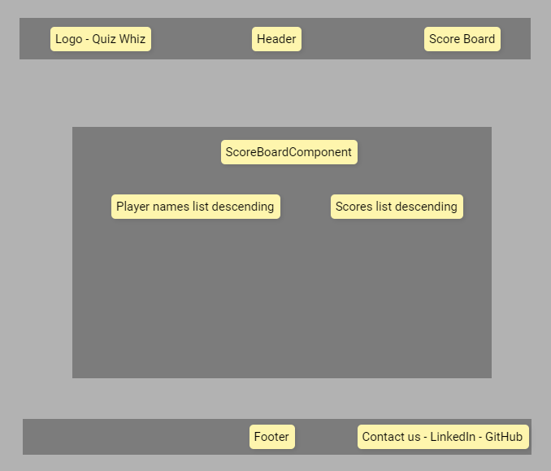

# :joystick:[Arcade Master](https://arcademaster.onrender.com/):joystick:

## Created by Bruno Gomes and Joao Murara

Application deployed :arrow_forward: [click here](https://arcademaster.onrender.com/) :arrow_backward:

Welcome to the MERN Stack Trivia Game repository. This trivia game is an interactive platform where users answer questions from a chosen category. Your progress and score are tracked, and at the end, you can add your name to the scoreboard.

## Table of Contents

1. [Technologies Used](#technologies-used)
2. [Features](#features)
3. [App Flow and Wireframes](#app-flow-and-wireframes)
4. [Components](#components)
5. [Tests](#tests)
6. [Project Management](#project-management)
7. [Unsolved Problems](unsolved-problems)
8. [Future Improvements](#future-improvements)
9. [Colors](#colors)
10. [Font Family](#font-family)
11. [Meet the Team](#meet-the-team)

## Technologies Used

-   **M**ongoDB
-   **E**xpress.js
-   **R**eact
-   **N**ode.js

Additional technologies and tools:

-   Styles

    -   [Material UI](https://mui.com/material-ui/getting-started/)

-   Test

    -   [Jest](https://jestjs.io/docs/tutorial-react)

-   HTTP Requests

    -   Axios

-   API

    -   [OpenTDB](https://opentdb.com/api_config.php?ref=altcademy.com)

-   Middleware

    -   cors - handling Cross-Origin Resource Sharing (CORS).

-   Version Control

    -   [GitHub](https://github.com/) and Git for version control and collaboration.

-   Deployment

    -   [Render.com](Render.com)

-   Development Tools

    -   [Visual Studio Code](https://code.visualstudio.com/) for the development environment.

    -   [npm](https://www.npmjs.com/) (Node Package Manager) for managing project dependencies.

-   React Router

-   Trello and Discord for project management

## Features

1. **Multiple Categories**: Users can choose from categories like Video Games, Film, Books, Computer Science, Math, and more.

2. **Question & Answer**: Displays questions, tracks user answers and provides feedback.

3. **Scoring System**: Keeps track of scores and lives for each quiz round.

4. **Leaderboard**: Displays the top scores from all players.

5. **Responsive Design**: The design is responsive and adapts to various screen sizes using Material-UI's `useMediaQuery`.

## App Flow and Wireframes

-- Our first idea for the project

1. **Landing Page**:

-   User arrives at the landing page.

-   **HeaderComponent** is displayed with the app logo and name.

-   **HowToPlayComponent** explains how the game works.

-   **SelectCategoryComponent** allows users to choose a trivia category.

-   **ReadyToStartGameComponent**: This component prompts the user to start the game after selecting a category.

2. **Game Start**:

-   On clicking "Start Game" in **ReadyToStartGameComponent**, the user is redirected to the **GameRoute**.

-   **GameComponent** initializes: - The **TimerComponent** starts the countdown from 20 seconds for the first question. - The **ScoreComponent** shows the initial score (likely 0). - The **LivesComponent** displays the number of lives the user starts with. - The **QuizComponent** fetches and displays the chosen category's first question and answer options.

3. **During Gameplay**:

-   The user selects an answer in the **QuizComponent**.

-   If correct:

-   The score updates in the **ScoreComponent**.

-   Move on to the next question.

-   If wrong:

-   A life is deducted in the **LivesComponent**.

-   Move on to the next question.

-   If the timer in the **TimerComponent** runs out before the user answers: - It acts as a wrong answer. - A life is deducted, and the game proceeds.

4. **End Game Scenarios**:

-   If the user runs out of lives, **GameOverComponent** is displayed with their score and an option to try again or view the scoreboard.

-   If there's a set number of questions or a winning condition and the user fulfils it, **YouWinComponent** is displayed with the same options as the Game Over scenario.

6. **Scoreboard**:

-   Once the game ends, the **ScoreBoardComponent** will mount and the player can add their names to the scoreboard.

-   The user can enter their name and view their score alongside other player scores (if backend integration is done).

7. **Returning to Home**:

-   The user can always navigate back to the landing page using a home button or icon.

8. **Footer**:

-   Displayed consistently across routes/pages containing any additional links or information.

## Components

The application is structured around various React components, each with a specific role and responsibility:

1. **App**:

-   The core component that renders the entire quiz application, using the `react-router-dom` for routing.

    -   Key Features:

    1.  **Routing**: Uses `react-router-dom` to navigate between selecting quiz categories, taking the quiz, and viewing the scoreboard.

    2.  **Theming**: Styled using the `ThemeProvider` from `@mui/material` with theme configurations from `app_styles.js`.

    3.  **Dynamic Component Rendering**: Depending on the game state (e.g., `isGameOver`, `category`), different components such as `Quiz`, `SelectCategory`, and `Scoreboard` are conditionally rendered.

2. **Quiz**:

-   The Quiz component manages quiz rounds, fetching questions from OpenTDB, tracking user lives, and displaying a countdown timer.

    -   Key Features:

    1.  **Countdown Timer**: Uses `react-countdown` for a time-bound quiz experience.

    2.  **Dynamic Question Fetching**: Retrieves questions based on user-selected categories using `Axios`.

    3.  **Scoring System**: Updates user's score and manages lives.

    4.  **GameOver Dialog**: Displays when the user runs out of time or lives

3. **SelectCategory**:

-   The component allows users to select a quiz category from a predefined list.

    -   Key Features:

    1.  **Category Selection**: Each category is rendered as a card, which, when clicked, triggers the selection of that category.

    2.  **Dynamic Rendering**: A list of predefined categories is dynamically mapped and displayed.

4. **Question**:

-   This component displays a question and its associated choices from a quiz. Users can select an answer, which will trigger feedback indicating if their selection was correct or not

    -   Key Features:

    1.  **Dynamic Question Rendering**: The current question and its choices are rendered from the provided props.

    2.  **Answer Feedback**: Upon answering, feedback is given to the user through images, indicating whether the answer was correct or not.

    3.  **Question Progression**: After selecting an answer, the component triggers a move to the next question.

    4.  **Score and Lives**: The component updates the user's score for correct answers and decrements live for incorrect answers.

5. **Scoreboard**:

-   The `Scoreboard` component displays the top scores from players. Additionally, it provides an input field for the current player to submit their name and score upon game completion.

    -   Key Features:

    1.  **Fetch and Display**: The component fetches and displays the top scores from the backend using the Axios library.

    2.  **Score Submission**: Allows the current player to submit their name (limited to three uppercase characters) and score to the backend.

    3.  **Real-time Score Updates**: After a user submits their score, the leaderboard dynamically updates to incorporate the new score.

    4.  **Input Validation**: Prevents players from submitting duplicate names and displays an error message if an unexpected error occurs.

    5.  **Name Input Animation**: Provides a pulsating animation on the name input field to draw attention.

    6.  **Spinner Loader**: Displays a loading spinner to indicate ongoing data fetching.

    7.  **Ranking System**: Uses a utility function (`getOrdinalSuffix`) to convert a player's rank into its corresponding ordinal representation.

## Tests

Our application has a suite of tests to ensure the core logic and main components function as expected. To run these tests, follow these steps:

1. Navigate to the main project directory.

2. Run the following command:

    `npm test`

This will start the test runner, and you should see the test results shortly.

1. `<Quiz />` Component:

**Objective**: To ensure that the `Quiz` component fetches and correctly displays a question.

2. `<Question />` Component:

**Objective**: To validate the rendering and interaction behaviours of the `Question` component.

**Test Breakdown**:

1. **Test**: "should render Question component"

    - **Rendering**: The `Question` component is rendered with mock properties.

    - **Assertions**:

    - Check if the rendered component displays the correct question text.

2. **Test**: "should display all answer choices"

    - **Rendering**: The `Question` component is rendered with mock properties.

    - **Assertions**:

    - Iterate each choice in `mockQuestion` and validate that they are present in the document.

3. **Test**: "should handle the correct answer."

    - **Mock Function**: A mock function is created for `updateScoreState` to monitor its call frequency.

    - **Rendering**: The `Question` component is rendered using the mock function.

    - **User Interaction**: Simulate a user by clicking the correct answer button.

    - **Assertions**:

    - Validate that the `updateScoreState` function was called once.

4. **Test**: "Should handle the wrong answer."

    - **Mock Function**: A mock function is created for `decrementLives` to monitor its call frequency.

    - **Rendering**: The `Question` component is rendered using the mock function.

    - **User Interaction**: Simulate a user clicking on a wrong answer button.

    - **Assertions**:

    - Validate that the `decrementLives` function was called once.

5. `<Scoreboard />` Component:

**Objective**: To validate that the `Scoreboard` component fetches and correctly displays scores.

4.  `<SelectCategory />` Component:

**Objective**: To validate that the `SelectCategory` component renders correctly, displays all categories, and calls the `onCategorySelected` function with the right category ID upon user interaction.

**Test Breakdown**:

1. **Test**: "should render SelectCategory component"

    - **Rendering**: The `SelectCategory` component is rendered with a mock function for the `onCategorySelected` prop.

    - **Assertions**:

    - Validate that the grid (which holds the categories) is present in the rendered component using a `data-testid`.

2. **Test**: "should render all categories"

    - **Rendering**: The `SelectCategory` component is rendered similarly to the previous test.

    - **Assertions**:

    - Loop through each category in the predefined list and check if they are in the rendered component.

3. **Test**: "should call onCategorySelected with correct category ID when the category is clicked"

    - **Mock Setup**: A mock function, `mockOnCategorySelected`, is set up to track the calls made to the `onCategorySelected` function.

    - **Rendering**: The `SelectCategory` component is rendered with the mock function for the `onCategorySelected` prop.

    - **User Interaction**: The "Video Game" category is clicked.

    - **Assertions**:

    - Check if the `onCategorySelected` function was called with the correct category ID for "Video Game", which is 15.

## Project Management

-   We are using a Trello board to manage and track how this project is going, and it's available here: [https://trello.com/b/ybbASD22/trivia-game-project](https://trello.com/b/ybbASD22/trivia-game-project)

## Unsolved Problems

## Future Improvements

-   Being able to play against someone live

-   Chat room for real-time interaction between players

-   [Copy the url](https://blog.dadops.co/2021/03/17/copy-and-paste-in-a-react-app/) button in the scoreboard to share with friends

-   OpenAI API - Integrate the app with AI to generate questions and check the answers given by the user.

## Colors

-    `#23143c`

-   success.main

-   info.main

-   warning.main

## Font Family

-   [Game Played](https://www.fontspace.com/game-played-font-f31380)

-   [Nintendo](https://www.fontspace.com/snes-font-f26537)

-   [Pixel](https://www.fontspace.com/pixel-emulator-font-f21507)

## Meet the Team

Meet the fantastic individuals who contributed to this project:

### [Joao Murara](https://www.linkedin.com/in/joao-murara/)

-   

-   

### [Bruno Gomes](https://www.linkedin.com/in/brunogomes11/)

-   

-   
